鳴鈴在家閒得沒事幹，於是前兩日前去洛陽轉了轉，權當畢業旅行。但去洛陽的兩天真的有夠熱的，縱使撐着傘，依然感覺「背灼炎天光」。

## 龍門石窟
龍門石窟確實古老，而且聽說文革時被紅小將們砸了不少。但鳴鈴一非佛教徒、二非學者、三非雕塑造像藝術家，對其亦沒有什麼太大的興趣。（即便走在伊水畔也絲毫不涼快就是了）

### 蔣宋別墅
唯一令鳴鈴感興趣的是位於龍門石窟景區伊水東岸香山上的蔣宋別墅。這個別墅是當時河南政府爲先總統夫婦修築的。位於中國大陸並同中國國民黨相關的景點，必然存在國父遺像、🇹🇼 青天白日滿地紅國旗和青天白日旗。當然啦，這裏也不例外.

> 遺民淚盡胡塵裏  
> 南望王師又一年  
> ------ *陸游*

鳴鈴什麼時候才能逃離胡塵呢。

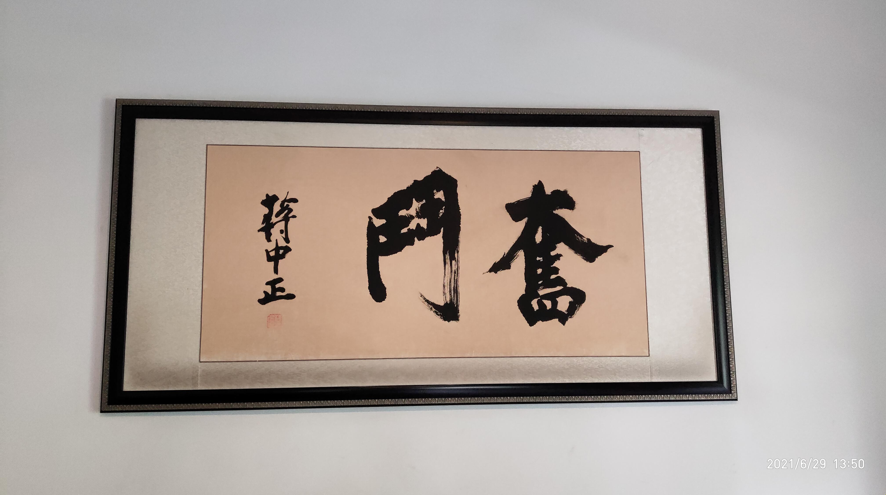 

唯一遺憾的是，🇹🇼 國旗沒有飄在旗杆上。 話說鳴鈴要是在那邊唱三民主義吾黨所宗以建民國以進大同的話，會被尋釁滋事的吧（怖いよ～

## 白馬寺
白馬寺被長者稱爲「中國第一~~咕殺~~古剎」，當然，白馬寺名副其實。不得不提的一點是, 鳴鈴最喜歡白馬寺的門票：

 

馬寺的門票所有漢字繁體直排，使用字體得當，寺院介紹以文言著，背景樸質而典雅，紙的撓度和表面粗糙度合適。無比重要的是，沒有什麼「國家xx級景區」、「重點xx保護單位」、「社會主義核心價值觀」、「依法納稅xx」之類意識形態的污染。票面上印有當年的干支，很有收藏價值。

你是不是想問鳴鈴爲什麼不給時間和編號打馬賽克？嗯，鳴鈴覺得這種東西史塔西或者蓋世太保是很好調查的，如果他們真的想的話。

泰國風格佛殿和緬甸風格佛殿對鳴鈴而言是很新鮮的：

 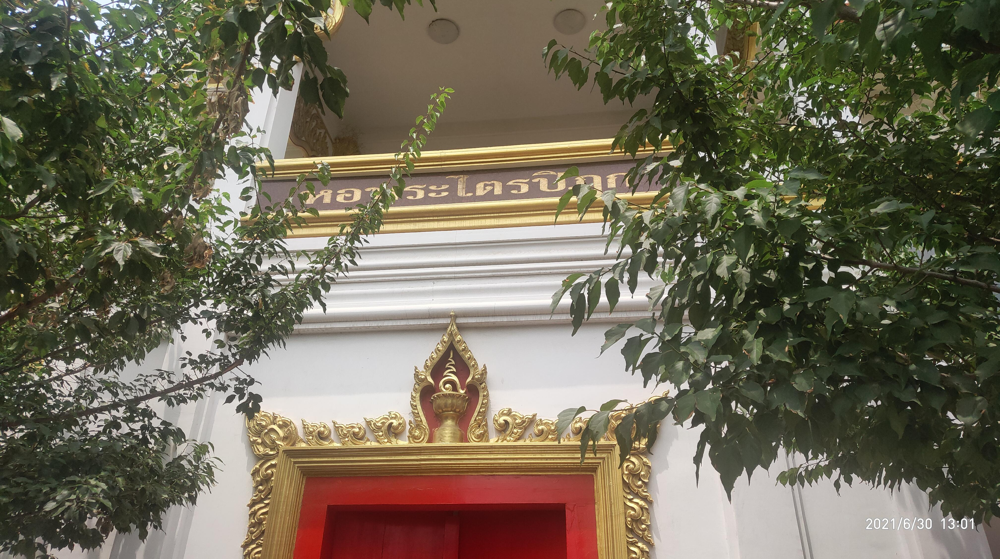

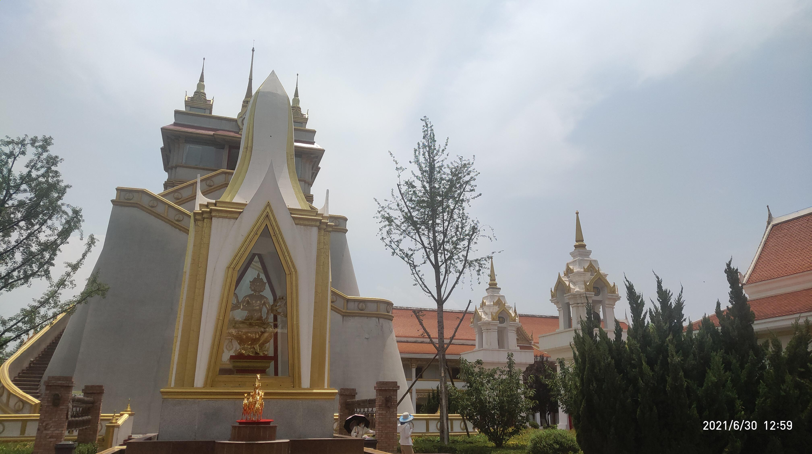  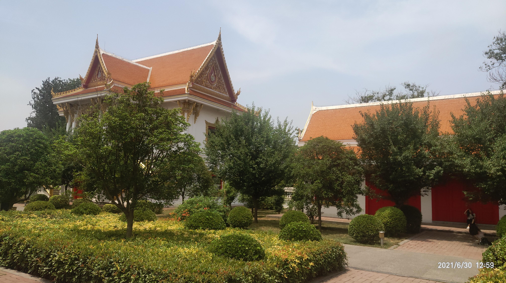

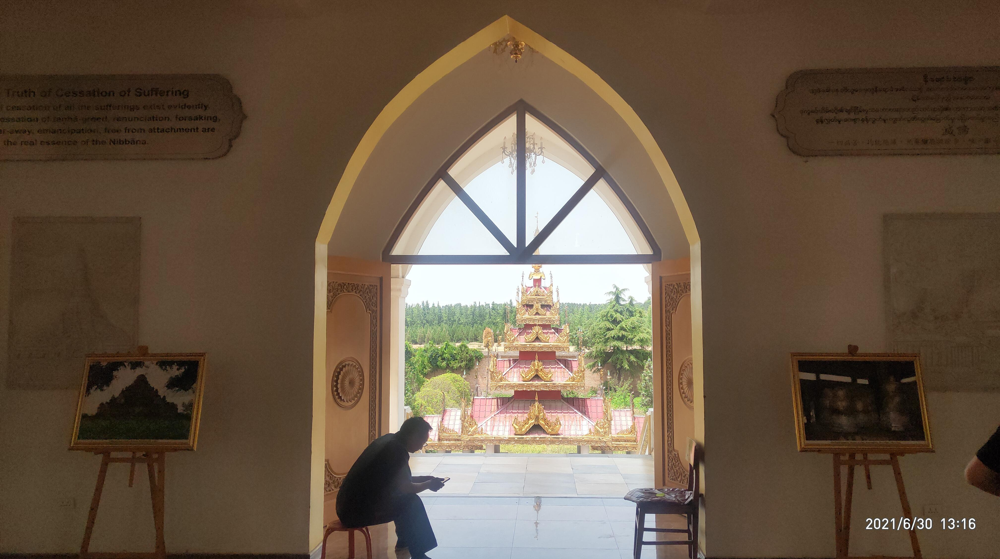 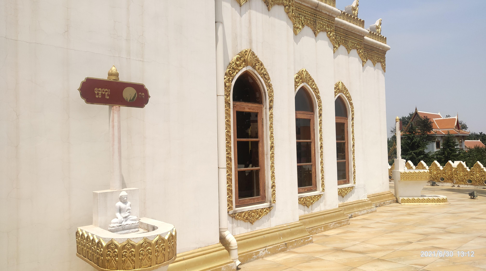

另外在泰國風格佛殿的某處門前放着這個牌子：

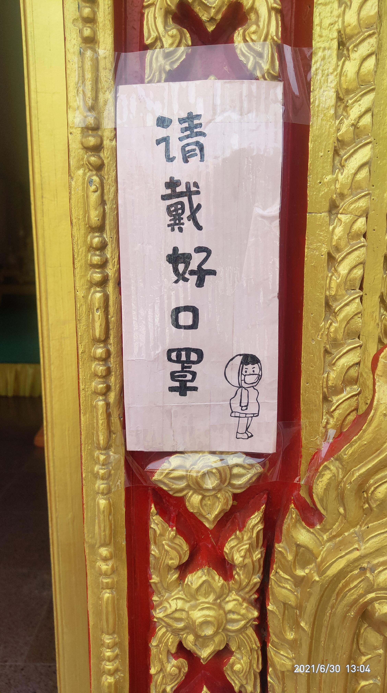

## 關林

關林係關二爺的墓（雖說只有頭葬在這裏）。洛陽的這個關林是曹操爲其修築的。關林中有自大明國起至當代各種人立的碑，說實話滿有趣的。下面按朝代分類一下拍到的碑記。

### 大明國

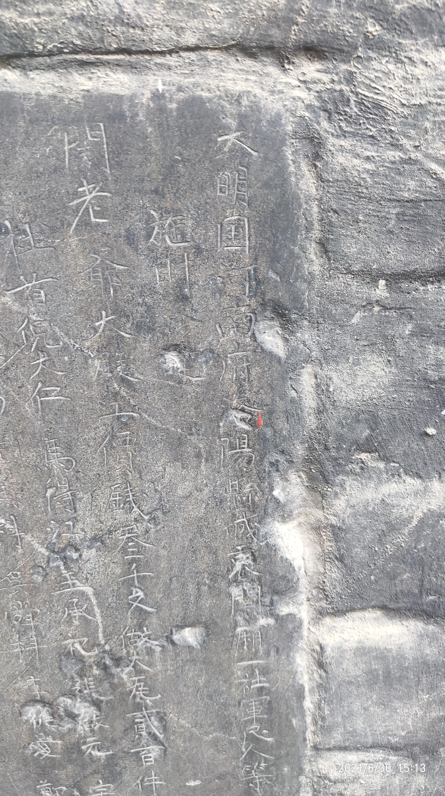 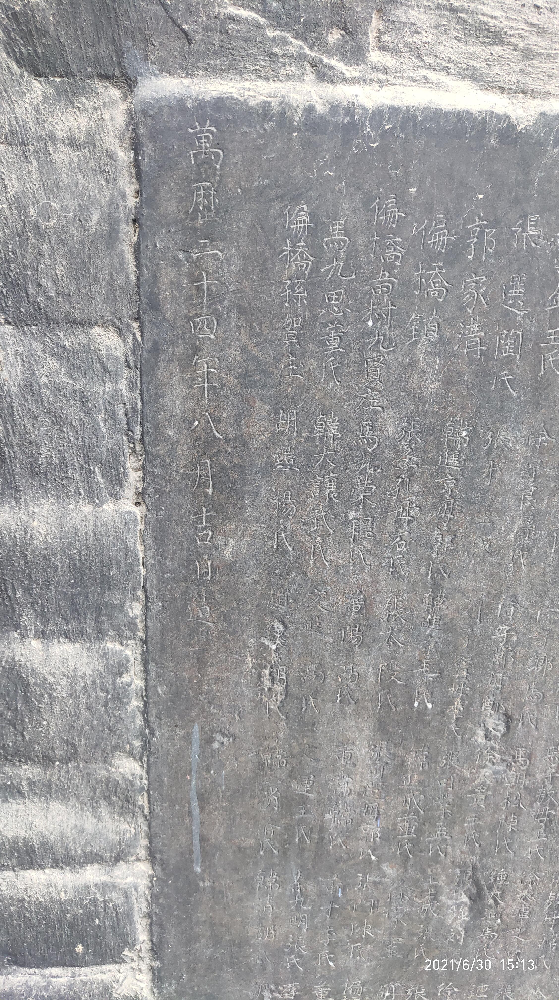

 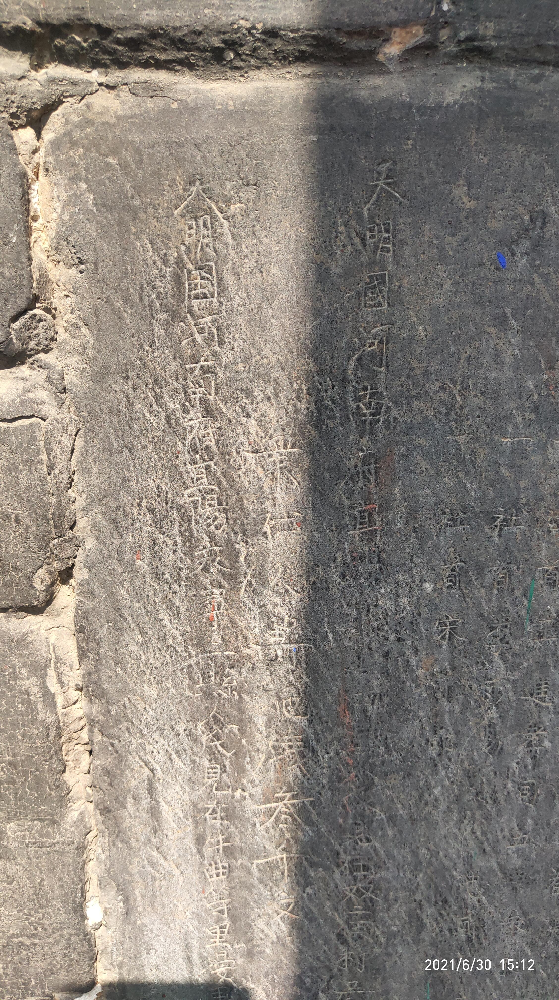 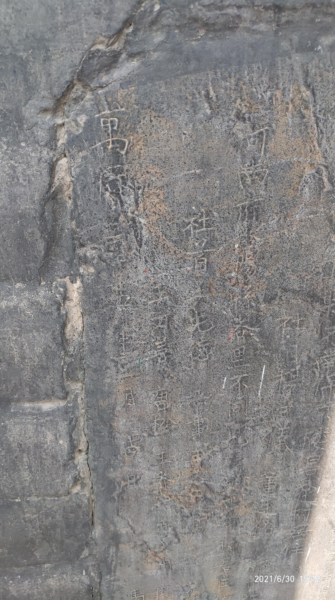

 

鳴鈴注意到：明朝時就已經開始混用「国」和「國」，還有「歷」和「曆」了。但是作爲年號應該是有唯一正確的寫法吧？

### 大清國

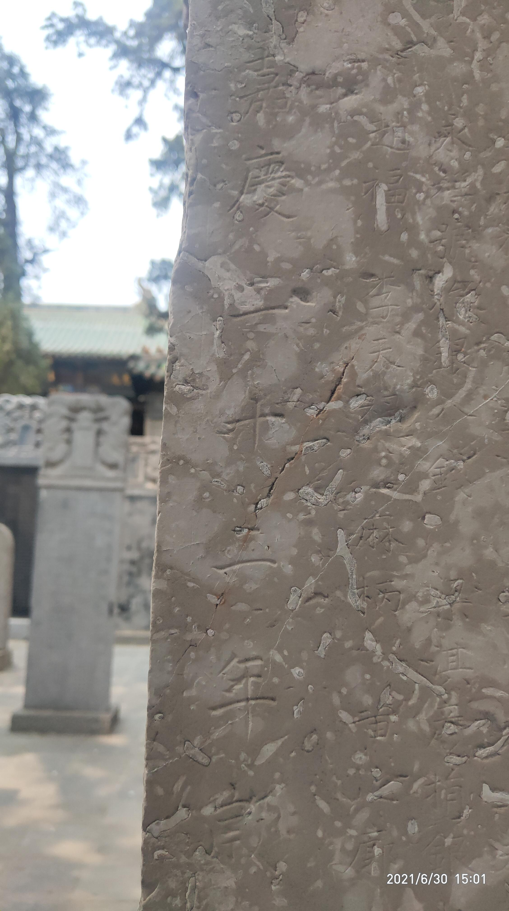 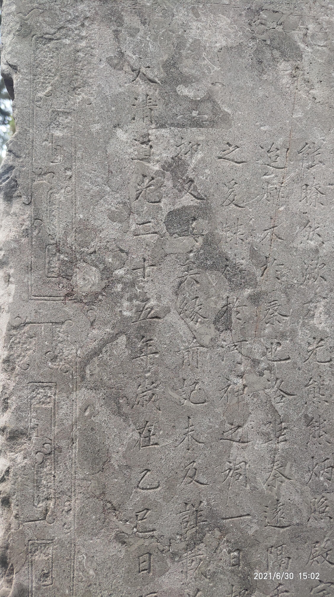 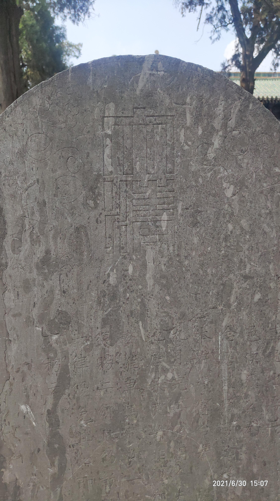

 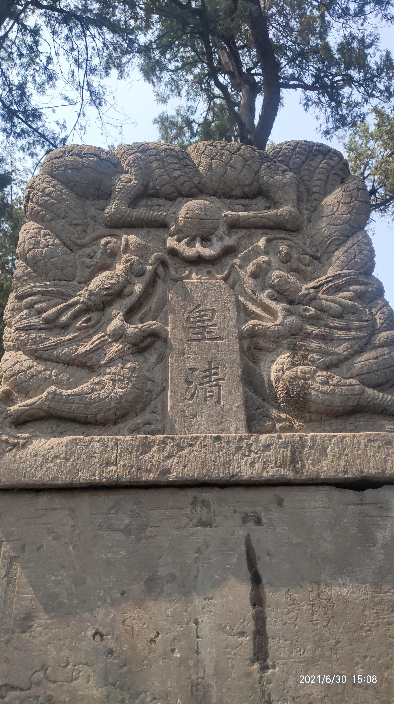

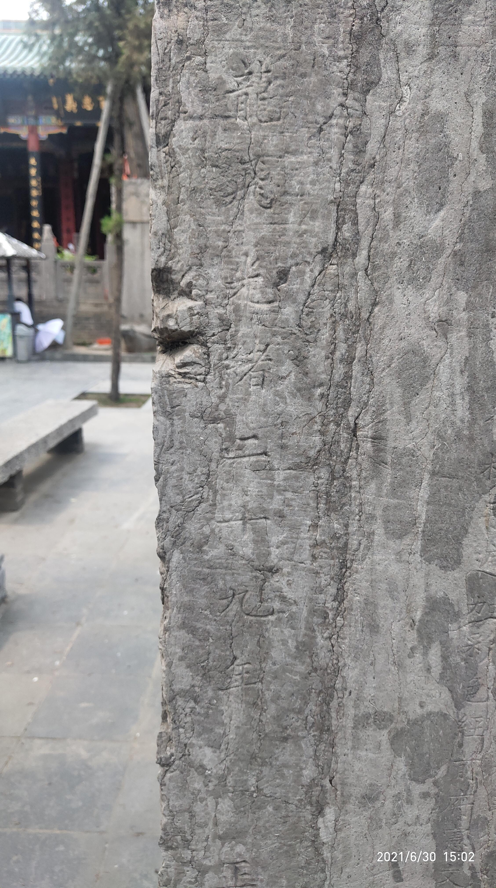  

下圖是乾隆年代所建的香爐，上面的花紋很漂亮，現在依然在使用。立於其前，雖然很熱，但更重要的是能嗅到歷史的氣息（別鬧啦，只是因爲爐內在焚香吧 -`д´- ） 此類有很長的歷史，卻依舊使用中，而非列於防爆玻璃展臺之內的文物真的感覺很奇妙。

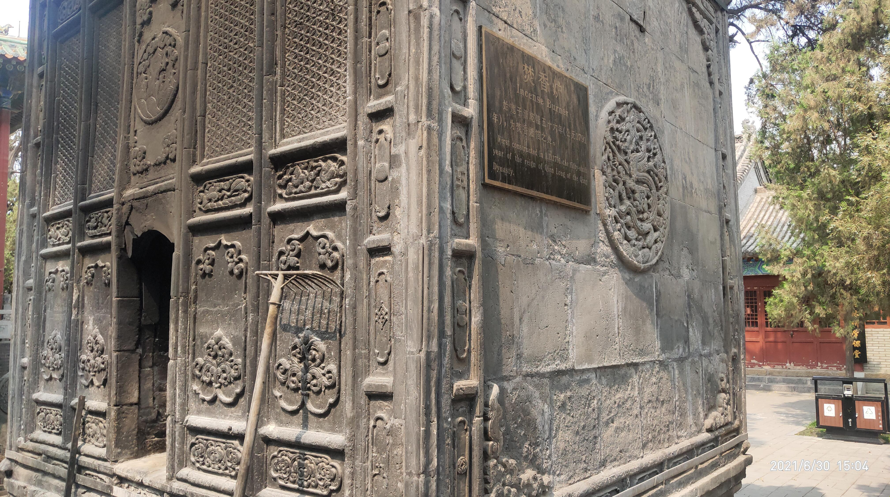

一般提到文物，給鳴鈴的印象就算不是陳設於展臺之上，也是石碑匾額之類單純供人觀賞的器物。所以鳴鈴就把這個還在使用中的香爐就拍了下來，這個香爐左右兩邊各有一個，鳴鈴攝的是右邊那個。

### 中華民國

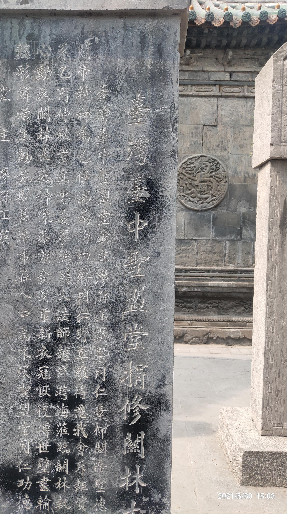  

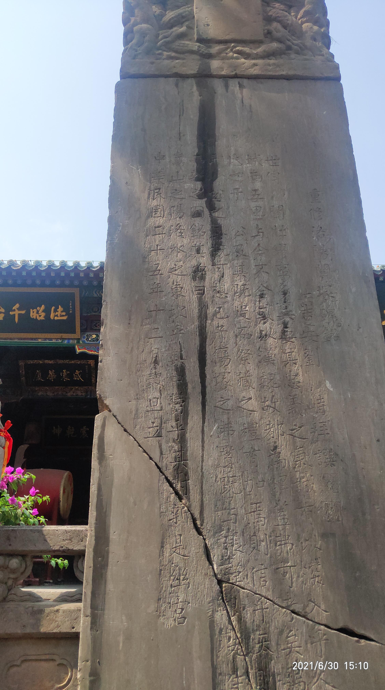  

### 僞朝
沒有什麼值得拍攝的 :)

## 跋
此行洛陽，鳴鈴覺得需要注意**切不可在仲夏酷暑隨便出來玩，雖然鳴鈴沒有煤紋病，但沒有做好防曬措施是可能會誘發皮膚癌的！縱使去洛陽這種北方城市好像也不太行的樣子。**，可以的話，儘量遠離北迴歸線吧 QAQ.